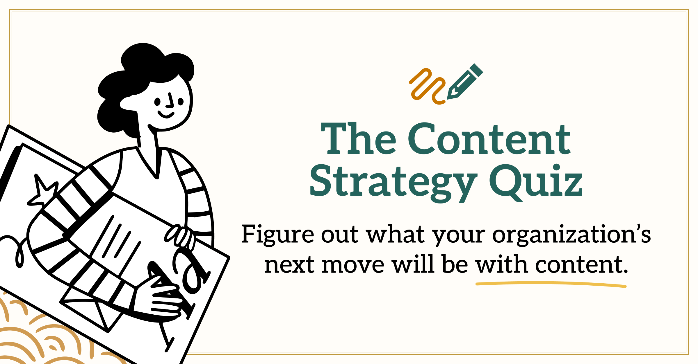

# The Content Strategy Quiz

## Prerequisites

- Running node 18.16 per the .npmrc file.
- `npm install`

## Built with

- [NextJS](https://nextjs.org/) as the JavaScript framework.
  - [Next.js Documentation](https://nextjs.org/docs) - learn about Next.js features and API.
  - [Learn Next.js](https://nextjs.org/learn) - an interactive Next.js tutorial.
- [TailwindCSS](https://tailwindcss.com/) for styling.
- [React Email](https://react.email/docs/introduction) for developing emails.
- Email sent with [Resend](https://resend.com/home).
- Deploys to [Netlify](https://www.netlify.com/)
- Domain name through [Namecheap](https://www.namecheap.com/)

## Running the site locally

- `npm run dev` will spin up the site on localhost:3000.

## Developing the Emails

- `npm run email` will spin up a preview of the emails at localhost:3001.

## Contributors

- Randy Oest, creative direction and frontend engineering
- Brendan Wu, project lead and UI designer
- Ashley Hitson, UI
- YOUR NAME HERE, ROLE(S)
